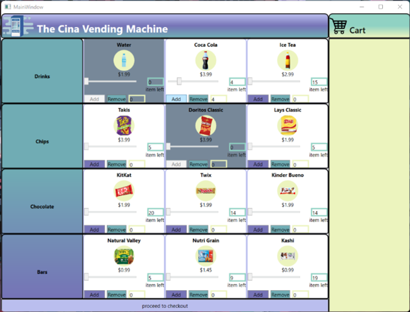

# VendingMachine
 
## Description

This application is a virtual vending machine. It allows a user to choose the quantity of an item that they would like to have in cart using sliders, an “Add” button, and a “Remove” button. Once the user is satisfied with what they have in their cart, they have the option to checkout. To checkout, a second window pops us, which allows the user to specify what payment method they would like to use. When that is decided and they pay for their items, they receive a receipt, it is saved to a file, and the user is given the option to open that file. The user can exit the payment screen, and everything will be reset so that the process can begin again.

The application both reads and writes to a couple files. On startup, the application reads from a stock data file to create all the product objects and get each products stock. This information is crucial for the application to run properly. The current file is a txt file, in which all the data is separated by commas. On each line, it starts with the product code, then the product name, then the product price, and ends with the product’s stock. At the end of every successful transaction, the application updates this stock data file so that it has the correct information. It also writes the receipt of the latest transaction to a transaction history file. The file is a simple txt file, and the newest receipts are found at the bottom of the file.

## Machine

This is the first window the user sees. The items with a gray background represent the products that are out of stock and the items with a white background are the products that are in stock.

This snapshot is demonstrating how to choose the quantity of an item. As can be seen, the slider for Coca Cola has been moved to be selecting 4.

To add the quantity of an item to the cart, click the “Add”.

This snapshot is demonstrating how once the “Add” button is clicked, the quantity, product name, and price are added to the cart on the right.In this case, all of the Coca Cola stock is added to the cart, which means it has no stock left, so it is grayed out.

This is demonstrating that to checkout the items in the cart, the “proceed to checkout” button must be clicked.

This is demonstrating that to checkout the items in the cart, the “proceed to checkout” button must be clicked.

## Checkout
The user must choose their payment type. In this snapshot, the user is deciding to pay with their debit or credit card.

but they could also choose cash, in this snapshot shows that the user has chosen to pay with cash, which means they have to enter the bill amount that they are using to pay.

then when the user click checkout a receipt will be shown:

then the user have the choice to save their transaction into a file and if they say
yes this it will output the receipt in a file

